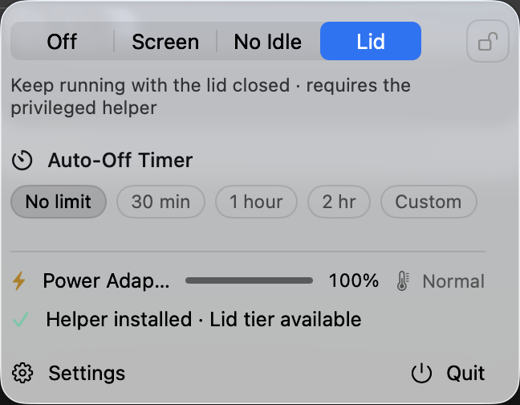

# NightCat

macOS 菜单栏保持唤醒工具。四档递进，不是通用电源管理器。

| 档位 | 行为 |
|---|---|
| **关闭** | 一切照常 |
| **屏幕常亮** | 屏幕不灭——演示、看盘 |
| **防空闲** | 系统不睡，屏幕可灭——下载、跑批、长任务 |
| **合盖不睡** | 合盖继续跑——无人值守、远程 |

安全网：定时关闭、档位锁定 + 二次确认、仅插电保持、低电量阈值、电池警示、
外部接管识别、退出恢复、Helper 看门狗防卡死。过热策略三选一：
**自动暂停 / 仅通知 / 忽略**。可选「启动时恢复合盖档」——重启后远程依旧可达。
可选「网络保活」：定时 ping 网关防空闲断链；掉线/换 IP 事件自动记录到
`~/Library/Logs/NightCat/network.log`，远程失联有据可查。

中英双语（跟随系统，可切换）、系统通知、猫头菜单栏图标按档位变色、Sparkle 自动更新。

<p align="center">
  
</p>

## 下载

从 [Releases](https://github.com/eliolewis77/NightCat/releases/latest) 下载 DMG
（已公证 + EdDSA 签名）。已安装的用户通过「设置 → 关于 → 检查更新」自动升级。

## 构建

```bash
brew install xcodegen        # Xcode 15+
xcodegen generate
xcodebuild build -scheme NightCat -destination 'platform=macOS' -configuration Debug
```

测试：`xcodebuild test -scheme NightCat-CI -destination 'platform=macOS' CODE_SIGNING_ALLOWED=NO`

> 运行需要开发者签名——特权 Helper 会校验 App 的代码签名。细节见 [`AGENTS.md`](AGENTS.md)。

## 架构

```
NightCat.app（SwiftUI MenuBarExtra，LSUIElement，非沙盒）
   │ XPC（Mach service = <bundle id>.helper）
   ▼
NightCatHelper（root LaunchDaemon，SMAppService 注册）
   │ pmset -a disablesleep · 90 秒心跳看门狗
   ▼
IOPMrootDomain SleepDisabled
```

- **App**：全部状态机与 UI；`Sources/NightCat`
- **Helper**：故意做薄，只写标志 + 收发心跳；`Sources/Helper`
- **Shared**：纯逻辑（安全评估、状态对账、定时），约 1300 行单测覆盖；`Sources/Shared`

## 来源与许可

fork 自 [nghialuong/Lidless](https://github.com/nghialuong/Lidless) v0.1.3（MIT）。
上游版权见 [`LICENSE`](LICENSE)，改造部分归本仓库所有者。
自动更新 feed：https://eliolewis77.github.io/NightCat/appcast.xml
